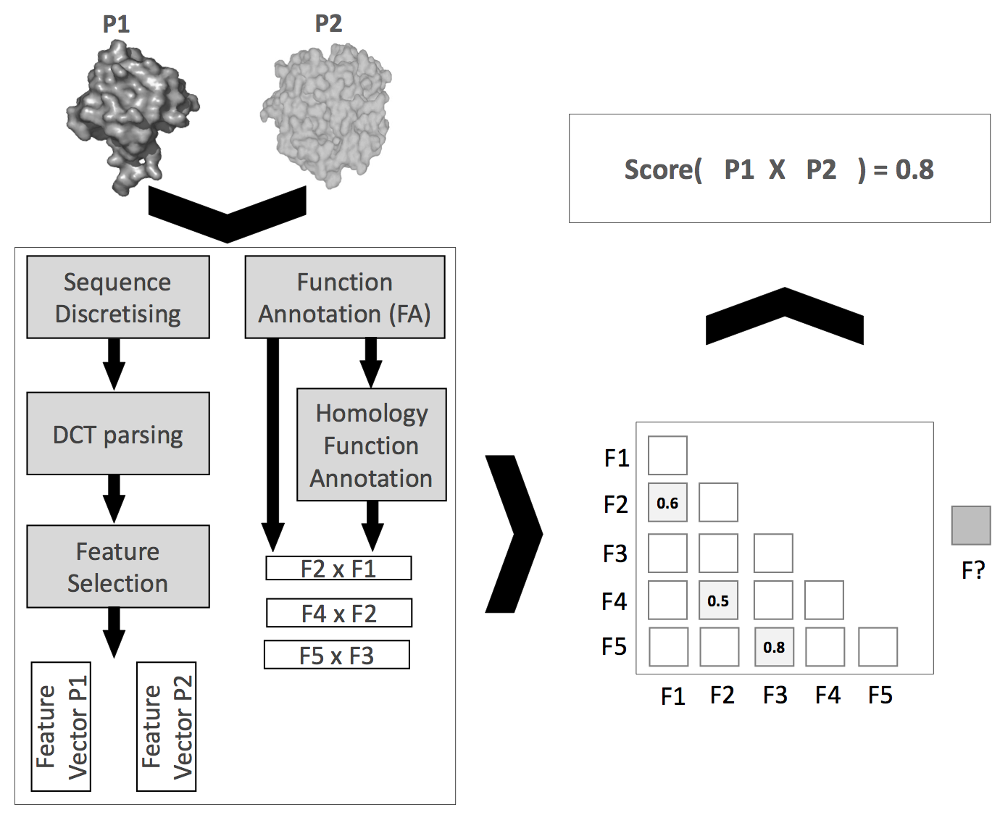

# Hydra
## Sequence-Based Classifiers for Prediction of Protein-Protein Interactions

> The Hydra is known for being the second monster that Heracles encounters during his twelve labors. Hydra had the confounding ability to regrow any decapitated limbs with alarming speed. It was said that for every head that was severed, two more would grow in it’s place. [(more)](https://en.wikipedia.org/wiki/Lernaean_Hydra)

  

    
The study of Protein-Protein Interac- tions (PPIs) has been a cornerstone in the clarification of complex physiological and pathogenic processes, thus being a priority for the identification of vital components and mechanisms in pathogens. 

Despite the advances of laboratory techniques, computational models allow the screening of protein interactions between entire proteomes in a fast and inexpensive manner. Hydra consists of a supervised machine learning model for the prediction of PPIs based on the protein sequence. We cluster amino acids regarding their physicochemical properties, and use the discrete cosine transform to represent protein sequences. A mesh of classifiers was constructed to create multiple hyper-specialized classifiers dedicated to the most relevant pairs of molecular function annotations from Gene Ontology. Based on an exhaustive evaluation that includes datasets with different configurations, cross-validation and out-of-sampling validation, the obtained results outscore the state-of-the-art for sequence-based methods. Using SVM with RBF, a consistent average AUC of 0.84 was attained.

 

  

 
 

